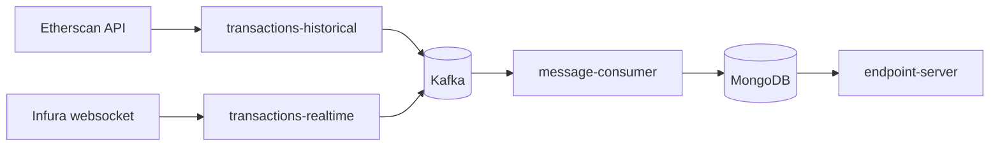

# eth-tx-pipeline

An event-driven Ethereum transaction processing pipeline. It tracks a single
contract (the Uniswap V3 USDC/WETH pool,
`0x88e6A0c2dDD26FEEb64F039a2c41296FcB3f5640`), backfills its historical
transactions from Etherscan, streams new ones from Infura, fans both through
Kafka into an enrichment consumer that computes each transaction's fee in ETH
and USD, and serves the result over a small REST API.



See [`docs/architecture.md`](docs/architecture.md) for the full component
diagram and per-service responsibilities, and
[`docs/message-schema.md`](docs/message-schema.md) for the exact Kafka
message and MongoDB document shapes.

## Status

This repository contains the monorepo foundation, infra wiring, contracts,
and CI. `message-consumer` implements Kafka consumption, fee enrichment,
and idempotent MongoDB upserts. `endpoint-server` reads those documents
with filter and pagination support, while `db-indexing-sidecar` creates the
required indexes. The producer services remain scaffold stubs for later
increments.

## Repository layout

```
services/
  transactions-historical/   # Etherscan -> Kafka batch backfill
  transactions-realtime/     # Infura websocket -> Kafka live feed
  message-consumer/          # Kafka -> enrich -> MongoDB
  endpoint-server/           # FastAPI read API over MongoDB
  db-indexing-sidecar/       # creates MongoDB indexes, exits
shared/
  eth_tx_shared/             # the message/document schema, shared by every service
docs/
  architecture.md
  message-schema.md
docker-compose.yml
```

Each service is an independent Python package: its own `Dockerfile`,
`requirements.txt`, `src/main.py` entrypoint, and `tests/`. They all depend
on `shared/eth_tx_shared` for the message schema (installed with
`pip install -e shared/`) - see
[`docs/message-schema.md`](docs/message-schema.md) for why a shared package
was chosen over duplicated definitions.

## Running it

```bash
cp .env.example .env   # fill in ETHERSCAN_API_KEY / INFURA_PROJECT_ID when you have them
docker compose up
```

This brings up Zookeeper, Kafka, MongoDB, and all five services.
`db-indexing-sidecar` runs its indexing job and exits `0` by design; every
other service stays up. `endpoint-server` is reachable at
`http://localhost:8000` (`/health`, `/transactions`, `/docs`). See the
OpenAPI docs for the transaction filter and pagination parameters.

## Running tests

Each service is tested independently. From a service directory:

```bash
pip install -r ../../requirements-dev.txt
pip install -e ../../shared
pip install -r requirements.txt
pytest
```

Lint the whole repo with `ruff check services shared`. CI
(`.github/workflows/ci.yml`) runs both for every service on every PR.
