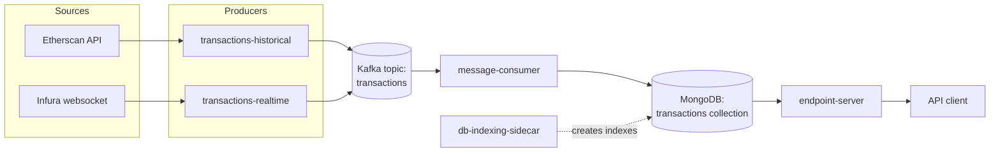

# Architecture

`eth-tx-pipeline` ingests Ethereum transactions for a single contract (the
Uniswap V3 USDC/WETH pool, `0x88e6A0c2dDD26FEEb64F039a2c41296FcB3f5640`) from
two sources - historical backfill and a live feed - fans both into one Kafka
topic, enriches each transaction with its fee in ETH/USD, and serves the
result over a REST API.

## Components

### transactions-historical
Fetches historical transactions for the configured contract from the
Etherscan API, walking the block range `[ETHERSCAN_HISTORICAL_FIRST_BLOCK,
ETHERSCAN_HISTORICAL_LAST_BLOCK]` in batches of
`ETHERSCAN_HISTORICAL_BATCH_SIZE` blocks. **Input:** Etherscan API.
**Output:** one Kafka message per transaction on `KAFKA_TOPIC`, shaped per
`TransactionMessage` (see [message-schema.md](message-schema.md)), with
`source="historical"`.

### transactions-realtime
Subscribes to new transactions for the same contract via an Infura
websocket (falling back to polling every `INFURA_POLL_INTERVAL` seconds if
the websocket is unavailable). **Input:** Infura. **Output:** the same
Kafka topic and message shape as transactions-historical, with
`source="realtime"`.

### message-consumer
Consumes `TransactionMessage`s from `KAFKA_TOPIC` under consumer group
`KAFKA_GROUP_ID`, computes `fee_eth = gas_price_wei * gas_used / 1e18` and
`fee_usd = fee_eth * eth_usd_exchange_rate`, and upserts the result into
MongoDB. The rate is currently a fixed, environment-configurable
`ETH_USD_EXCHANGE_RATE` (default `3000.0`) so enrichment is deterministic
and needs no external credential. A future live or historical rate provider
can replace this configuration at the enrichment boundary while preserving
the rate captured in each document. **Input:** Kafka. **Output:** one
`EnrichedTransaction` document per transaction in the `transactions`
collection, keyed by `_id = tx_hash` for idempotent replay. Kafka offsets
are committed only after a successful MongoDB upsert.

### db-indexing-sidecar
Connects to MongoDB, ensures the indexes the API's query patterns depend
on exist (`block_number`, `contract_address`, `block_timestamp`,
`from_address`, `to_address`), then exits `0`. Runs once per
`docker compose up` before other consumers rely
on the collection being queryable at speed. **Input:** none. **Output:**
MongoDB indexes (side effect only).

### endpoint-server
A FastAPI REST API that reads the `transactions` collection. `GET
/transactions` filters by exact sender or recipient `address`, inclusive
`block_number_from` / `block_number_to`, and inclusive Unix-second
`timestamp_from` / `timestamp_to`. Results use offset/limit pagination
(default limit 50, maximum 100), are ordered by block number and transaction
hash, and include the total matching document count. `/health` and the
auto-generated `/docs` page are also available. **Input:** MongoDB.
**Output:** JSON HTTP responses.

## Decided technical choices

- **Kafka client:** `confluent-kafka` (librdkafka-backed), matching the
  `confluentinc` images used for Kafka/Zookeeper in `docker-compose.yml`.
- **Mongo client:** `pymongo`.
- **Shared schema:** a single installable package (`shared/eth_tx_shared`)
  rather than duplicated dataclasses per service - see
  [message-schema.md](message-schema.md) for the tradeoff this makes.
- **Python:** 3.12 everywhere, linted with `ruff`, tested with `pytest`.
